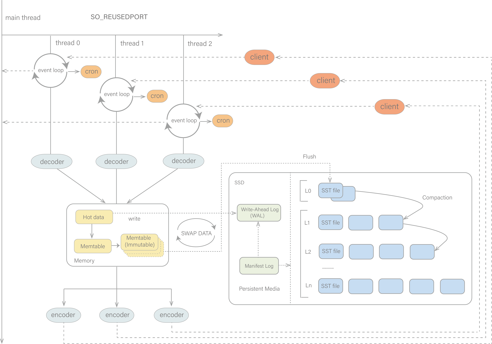
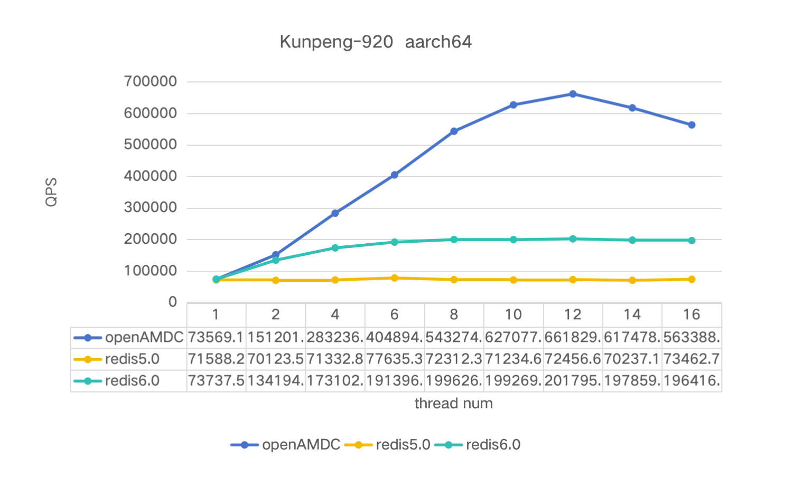

What is openAMDC?
-----------------

openAMDC is an open source, high-performance, in-memory, key-value database. It is compatible with all the commands, protocol and data structures that were originally available in Redis, making it feasible to utilize openAMDC as a direct substitute for Redis. The architecture of openAMDC is as follows:

 

  

The following are the main enhancements of openAMDC in comparison to Redis:

* Multi-threaded architecture: openAMDC is a multi-process architecture, which means that it can be run on multiple cores. When openAMDC starts, it will initialize multiple worker threads. In each worker thread, an event loop will be started for listen events, and the SO_REUSEPORT option is set for each listener to enable the kernel load balancing of network connections, allowing multiple threads to bind the same port. It is equivalent to that each thread has a completed queue of the listen socket in the queue, avoiding the resource contention of the shared listen socket and enhancing the concurrent throughput. The kernel evenly distributes new connections to each thread that has enabled the SO_REUSEPORT attribute through the load balancing algorithm.

* Data swap architecture: Redis employs memory as the storage medium, which exhibits excellent performance and low latency, but its memory capacity often turns into a bottleneck, and the memory price is relatively high, causing a high usage cost of Redis. openAMDC extends the data swap function on the basis of the multi-threaded architecture, and uses RocksDB as the back-end storage engine to achieve the multi-level storage of openAMDC data to reduce the comprehensive usage cost.

Benchmarking openAMDC
---------------------
`worker-threads` is a configuration item of openAMDC, which is used to set the number of working threads of openAMDC. By increasing the number of working threads, the concurrent processing ability of the openAMDC server can be improved, thereby enhancing the overall performance.
      
      openamdc-server --h 127.0.0.1 --p 6379 --worker-threads 8 --save ""

* openamdc-benchmark is a benchmarking tool for openAMDC. Remember to enable the threads option for testing.  

      openamdc-benchmark -h 127.0.0.1 -p 6379 -n 5000 -c 50 --threads 8

* [memtier_benchmark](https://github.com/RedisLabs/memtier_benchmark) is a command line utility developed by RedisLabs for load generation and bechmarking NoSQL key-value databases.  

      memtier_benchmark -s 127.0.0.1 -p 6379 -t 8 -c 50 -n 5000 --hide-histogram --distinct-client-seed --command="set __key__ __data__" --key-prefix="kv_" --key-minimum=1 --key-maximum=10000 -R -d 128

Some test results using memtier_benchmark:

  

Some request latency results under 8 threads:

 

| 8 threads| Ops/sec | Avg Latency | p50 Latency | p99 Latency | p99.9 Latency | KB/sec |
|:--------:|:-------:|:-----------:|:-----------:|:-----------:|:-------------:|:------:|
| openAMDC |543274.68|   0.84819   |    0.823    |    1.335    |      4.511    |88541.95|
|  redis   |199626.36|   2.01135   |    1.703    |    5.151    |      7.935    |32534.75|

Building openAMDC
-----------------

openAMDC can be compiled and used on Linux, OSX, OpenBSD, NetBSD, FreeBSD.
We support big endian and little endian architectures, and both 32 bit
and 64 bit systems.

It may compile on Solaris derived systems (for instance SmartOS) but our
support for this platform is *best effort* and openAMDC is not guaranteed to
work as well as in Linux, OSX, and \*BSD.

It is as simple as:

    % make

To build with TLS support, you'll need OpenSSL development libraries (e.g.
libssl-dev on Debian/Ubuntu) and run:

    % make BUILD_TLS=yes

To build with systemd support, you'll need systemd development libraries (such 
as libsystemd-dev on Debian/Ubuntu or systemd-devel on CentOS) and run:

    % make USE_SYSTEMD=yes

To append a suffix to openAMDC program names, use:

    % make PROG_SUFFIX="-alt"

You can build a 32 bit openAMDC binary using:

    % make 32bit

After building openAMDC, it is a good idea to test it using:

    % make test

If TLS is built, running the tests with TLS enabled (you will need `tcl-tls`
installed):

    % ./utils/gen-test-certs.sh
    % ./runtest --tls

Fixing build problems with dependencies or cached build options
---------

openAMDC has some dependencies which are included in the `deps` directory.
`make` does not automatically rebuild dependencies even if something in
the source code of dependencies changes.

When you update the source code with `git pull` or when code inside the
dependencies tree is modified in any other way, make sure to use the following
command in order to really clean everything and rebuild from scratch:

    make distclean

This will clean: jemalloc, lua, hiredis, linenoise.

Also if you force certain build options like 32bit target, no C compiler
optimizations (for debugging purposes), and other similar build time options,
those options are cached indefinitely until you issue a `make distclean`
command.

Fixing problems building 32 bit binaries
---------

If after building openAMDC with a 32 bit target you need to rebuild it
with a 64 bit target, or the other way around, you need to perform a
`make distclean` in the root directory of the openAMDC distribution.

In case of build errors when trying to build a 32 bit binary of openAMDC,
try the following steps:

* Install the package libc6-dev-i386 (also try g++-multilib).
* Try using the following command line instead of `make 32bit`:
  `make CFLAGS="-m32 -march=native" LDFLAGS="-m32"`

Allocator
---------

Selecting a non-default memory allocator when building openAMDC is done by
setting the `MALLOC` environment variable. openAMDC is compiled and linked
against libc malloc by default, with the exception of jemalloc being the
default on Linux systems. This default was picked because jemalloc has proven
to have fewer fragmentation problems than libc malloc.

To force compiling against libc malloc, use:

    % make MALLOC=libc

To compile against jemalloc on Mac OS X systems, use:

    % make MALLOC=jemalloc

Monotonic clock
---------------

By default, openAMDC will build using the POSIX clock_gettime function as the
monotonic clock source.  On most modern systems, the internal processor clock
can be used to improve performance.  Cautions can be found here: 
    http://oliveryang.net/2015/09/pitfalls-of-TSC-usage/

To build with support for the processor's internal instruction clock, use:

    % make CFLAGS="-DUSE_PROCESSOR_CLOCK"

Verbose build
-------------

openAMDC will build with a user-friendly colorized output by default.
If you want to see a more verbose output, use the following:

    % make V=1

Running openAMDC
----------------

To run openAMDC with the default configuration, just type:

    % cd src
    % ./openamdc-server

If you want to provide your openamdc.conf, you have to run it using an additional
parameter (the path of the configuration file):

    % cd src
    % ./openamdc-server /path/to/openamdc.conf

It is possible to alter the OpenAmdc configuration by passing parameters directly
as options using the command line. Examples:

    % ./openamdc-server --port 9999 --replicaof 127.0.0.1 6379
    % ./openamdc-server /etc/openamdc/6379.conf --loglevel debug

All the options in redis.conf are also supported as options using the command
line, with exactly the same name.

Running openAMDC with TLS:
-------------------------

Please consult the [TLS.md](TLS.md) file for more information on
how to use openAMDC with TLS.

Playing with openAMDC
---------------------

You can use openamdc-cli to play with openAMDC. Start a openamdc-server instance,
then in another terminal try the following:

    % cd src
    % ./openamdc-cli
    openamdc> ping
    PONG
    openamdc> set foo bar
    OK
    openamdc> get foo
    "bar"
    openamdc> incr mycounter
    (integer) 1
    openamdc> incr mycounter
    (integer) 2
    openamdc>

Installing openAMDC
-------------------

In order to install openAMDC binaries into /usr/local/bin, just use:

    % make install

You can use `make PREFIX=/some/other/directory install` if you wish to use a
different destination.

Make install will just install binaries in your system, but will not configure
init scripts and configuration files in the appropriate place. This is not
needed if you just want to play a bit with openAMDC, but if you are installing
it the proper way for a production system, we have a script that does this
for Ubuntu and Debian systems:

    % cd utils
    % ./install_server.sh

_Note_: `install_server.sh` will not work on Mac OSX; it is built for Linux only.

The script will ask you a few questions and will setup everything you need
to run openAMDC properly as a background daemon that will start again on
system reboots.

You'll be able to stop and start openAMDC using the script named
`/etc/init.d/openamdc_<portnumber>`, for instance `/etc/init.d/openamdc_6379`.

Code contributions
------------------

Note: Contribute code to the openAMDC project by sending a pull request via
Gitee, you agree to release your code under the terms of the MulanPSLv2 license
that you can find in the COPYING file included in the openAMDC source
distribution. You will include MulanPSLv2 license in the COPYING file within each
source file that you contribute.

1. If it is a major feature or a semantical change, create an [issue](.github/ISSUE_TEMPLATE/feature_request.md)
at Gitee with the description of, exactly, what you want to accomplish and why.
Use cases are important for features to be accepted. 

2. If in step 1 you get an acknowledgment from the project leaders, use the
   following procedure to submit a patch;

    a. Fork openAMADC on gitee  
    b. Create a topic branch (git checkout -b my_branch)  
    c. Push to your branch (git push origin my_branch)  
    d. Initiate a pull request on gitee (https://help.gitee.com/base/pullrequest/Fork+Pull)  
    e. Done :)

3. For minor fixes just open a pull request on Gitee.

To-Do List
----------

*  Data swap architecture, openAMDC stores hot data and cold data in memory and RocksDB respectively, expands the storage capacity of openAMDC, and supports the automatic exchange and balance of memory data and SSD data.
*  Compatibility Upgrade from redis 6.2 to redis 7.2.
