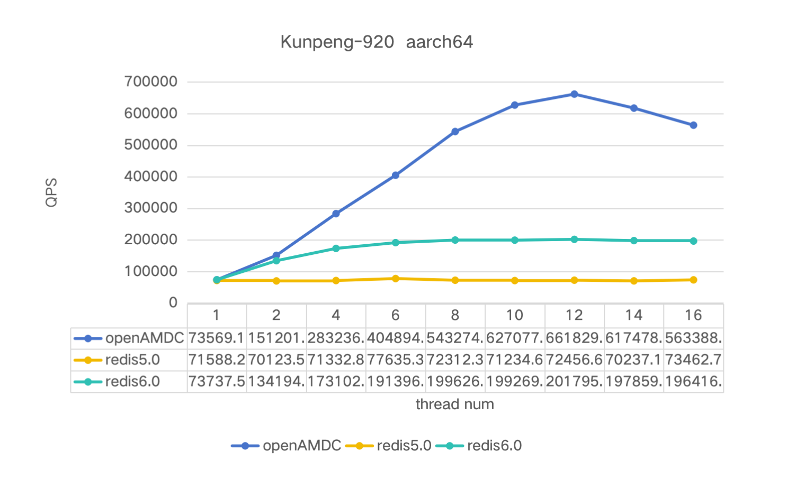

什么是openAMDC?
--------------

openAMDC是一个开源且高性能的键值内存数据库，兼容所有Redis命令、协议以及数据结构，可以轻松使用openAMDC来替换已有的Redis服务。openAMDC架构如下：

 

  

以下是openAMDC与Redis相比主要的改进：

* 多线程架构：openAMDC在启动时会初始化多个worker线程，每个worker线程中会启动一个事件循环用于监听事件，为每个listen监听设置SO_REUSEPORT选项，启用网络连接内核负载均衡，允许多个线程绑定相同的端口号，相当于每个线程拥有队里的listen socket完成队列，避免了共享listen socket的资源争抢，提升了并发吞吐，内核通过负载均衡算法，将新链接相对均匀的分配给每个开启了SO_REUSEPORT属性的线程。

* 数据交换架构: Redis使用内存作为存储介质，具有良好的性能和低延迟，但其内存容量通常成为瓶颈，且内存价格较高，导致Redis使用成本较高。openAMDC在多线程架构的基础上扩展数据交换功能，实现openAMDC数据冷热多级存储，降低缓存的综合使用成本。

openAMDC基准测试
---------------
`worker-threads`是openAMDC的一个配置项，用于设置openAMDC的工作线程数量。通过增加工作线程的数量，可以提高openAMDC服务器的并发处理能力，从而提升整体性能。
      
      openamdc-server --h 127.0.0.1 --p 6379 --worker-threads 8 --save ""

* openamdc-benchmark是openAMDC的基准测试工具，注意在测试时启用--threads选项。

      openamdc-benchmark -h 127.0.0.1 -p 6379 -n 5000 -c 50 --threads 8

* [memtier_benchmark](https://github.com/RedisLabs/memtier_benchmark) 是由RedisLabs开发的一个命令行程序，用于对NoSQL键值数据库进行进行基准测试。

      memtier_benchmark -s 127.0.0.1 -p 6379 -t 12 -c 50 -n 5000 --hide-histogram --distinct-client-seed --command="set __key__ __data__" --key-prefix="kv_" --key-minimum=1 --key-maximum=10000 -R -d 128

使用memtier_benchmark的一些测试结果：

  

8线程下请求延迟对比：

 

| 8 threads| Ops/sec | Avg Latency | p50 Latency | p99 Latency | p99.9 Latency | KB/sec |
|:--------:|:-------:|:-----------:|:-----------:|:-----------:|:-------------:|:------:|
| openAMDC |543274.68|   0.84819   |    0.823    |    1.335    |      4.511    |88541.95|
|  redis   |199626.36|   2.01135   |    1.703    |    5.151    |      7.935    |32534.75|

构建openAMDC
------------

openAMDC可以在Linux、OSX、OpenBSD、NetBSD、FreeBSD上编译和使用，并支持大端序和小端序架构，
以及32位和64位系统。

openAMDC不一定年能在源自Solaris的系统（例如 SmartOS）上编译，但我们对该平台的支持是“尽力而为”
并且不能保证openAMDC在Linux、OSX和*BSD中那样良好地工作。

可以使用以下命令编译openAMDC:

    % make

如果构建时需要TLS支持，您将需要在系统中安装OpenSSL开发库（例如在 Debian/Ubuntu 上的 libssl-dev）并运行:

    % make BUILD_TLS=yes

如果构建时需要systemd支持，您将需要在系统中安装systemd开发库（比如在 Debian/Ubuntu上的libsystemd-dev或者在
CentOS上的systemd-devel）并运行：

    % make USE_SYSTEMD=yes

要给openAMDC程序名添加一个后缀，使用：

    % make PROG_SUFFIX="-alt"

您可以使用以下方式构建一个32位的openAMDC二进制文件：

    % make 32bit

在构建openAMDC之后，使用以下方式对其进行测试：

    % make test

如果构建时使用了TLS选项，测试时需启用TLS来运行测试（需要安装“tcl-tls”）：

    % ./utils/gen-test-certs.sh
    % ./runtest --tls

修复与依赖项或缓存构建选项相关的问题
---------

openAMDC 有一些依赖项，它们包含在`deps`目录中，`make`不会自动重新构建依赖项，即使依赖项的源代码中有某些东西发生了变化。

当您使用`git pull`更新源代码，或依赖项内的代码以任何方式被修改时，确保使用以下命令来真正清理所有内容并从头开始重新构建：

    make distclean

这个命令将清理: jemalloc, lua, hiredis, linenoise.

此外，如果您强制更新了某些构建选项，如32位目标、关闭C编译器优化（出于调试目的）以及其他类似的构建时间选项，这些选项会被无限期
地缓存，直到您发出`make distclean`命令。

修复构建32位二进制文件问题
---------

如果在以32位目标构建openAMDC之后，你需要以64位目标重新构建它，反过来也是一样的，您需要在openAMDC的根目录执行`make distclean`。

如果在尝试构建32位的openAMDC二进制文件出现构建错误时，请尝试以下步骤：

* 安装软件包libc6-dev-i386（也可以尝试 g++-multilib）。
*  尝试使用以下命令行来代替`make 32bit`: `make CFLAGS="-m32 -march=native" LDFLAGS="-m32`。

内存分配器
--------

在构建openAMDC时选择非默认的内存分配器是通过设置`MALLOC`境变量来完成的。默认情况下，openAMDC是使用libc分配器进行编译和链接的，
但在Linux系统上，jemalloc是默认使用的。选择这个默认是因为jemalloc比libc分配器有更少的的内存碎片化问题。

要强制使用libc分配器进行编译，使用：

    % make MALLOC=libc

要在Mac OSX系统上使用jemalloc进行编译，使用：

    % make MALLOC=jemalloc

单调时钟
-------

默认情况下，openAMDC将使用POSIX clock_gettime函数作为单调时钟源进行构建。在大多数现代系统中，可以使用内部处理器时钟来提高性能。
注意事项可在此处找到：
    http://oliveryang.net/2015/09/pitfalls-of-TSC-usage/

要构建以支持处理器的内部指令时钟，使用：

    % make CFLAGS="-DUSE_PROCESSOR_CLOCK"

详细构建
-------

openAMDC 默认会以用户友好的彩色输出进行构建。如果你想看到更详细的输出，使用以下方式：

    % make V=1

运行openAMDC
-----------

要使用默认配置运行 openAMDC，只需输入：

    % cd src
    % ./openamdc-server

如果您想要使用您的openamdc.conf，您必须使用一个额外的参数（配置文件的路径）来运行它：

    % cd src
    % ./openamdc-server /path/to/openamdc.conf

可以通过在命令行上直接将参数作为选项传递来更改openAMDC配置。示例：

    % ./openamdc-server --port 9999 --replicaof 127.0.0.1 6379
    % ./openamdc-server /etc/openamdc/6379.conf --loglevel debug

redis.conf中的所有选项也都可以作为命令行选项，名称完全相同。

使用TLS运行openAMDC：
------------------

请查阅[TLS.md](TLS.md)文件来获取有关如何使用支持TLS的openAMDC的更多详细信息。

使用openAMDC
------------

您可以使用openamdc-cli来与openAMDC互动。启动一个openamdc-server实例，然后在另一个终端尝试以下操作：

    % cd src
    % ./openamdc-cli
    openamdc> ping
    PONG
    openamdc> set foo bar
    OK
    openamdc> get foo
    "bar"
    openamdc> incr mycounter
    (integer) 1
    openamdc> incr mycounter
    (integer) 2
    openamdc>

安装openAMDC
------------

为了将openAMDC二进制文件安装到/usr/local/bin, 只需使用：

    % make install

如果您希望安装到一个自定义路径，您可以使用`make PREFIX=/some/other/directory install`。

`make install`只会在你的系统中安装二进制文件，但不会在适当位置配置初始化脚本和配置文件。如果您只是想简单试用一下openAMDC,
这是不需要的，但如果你要以正确的方式为生产系统进行安装，我们有一个针对Ubuntu和Debian系统的脚本可以做到这一点：

    % cd utils
    % ./install_server.sh

注意：`install_server.sh`在Mac OSX上不起作用；它仅为 Linux 构建。

该脚本会问你几个问题，并将设置好您需要的一切，以便将openAMDC正确地作为一个后台守护进程运行，该进程会在系统重启时再次启动。

您将能够使用名为/etc/init.d/openamdc_<portnumber>的脚本停止和启动openAMDC，例如/etc/init.d/openamdc_6379。

代码贡献
-------

注意：通过Gitee发送拉取请求向openAMDC项目贡献代码，即表示您同意根据在openAMDC源代码分发中包含的COPYING文件中可找到的MulanPSLv2许可
条款发布您的代码。您将在您所贡献的每个源代码文件内的COPYING文件中包含MulanPSLv2许可。

1. 如果这是一个重要的特性或语义上的改变，请在Gitee上创建一个[问题](.github/ISSUE_TEMPLATE/feature_request.md)，准确地描述你想要实现的内容以及原因,用例对于特性被接受很重要。

2. 如果从项目负责人那里得到了步骤1的确认，使用以下程序来提交一个补丁：

    a. 在Gitee上克隆openAMADC  
    b. 创建一个主题分支 (git checkout -b my_branch)  
    c. 推送到您的分支 (git push origin my_branch)  
    d. 在Gitee上发起一个拉取请求 (https://help.gitee.com/base/pullrequest/Fork+Pull)  
    e. 完成 :)

3. 对于小的修复，只需在Gitee上打开一个拉取请求。

待办事项列表
----------

* 兼容性升级：从redis 6.2升级到redis 7.2。
